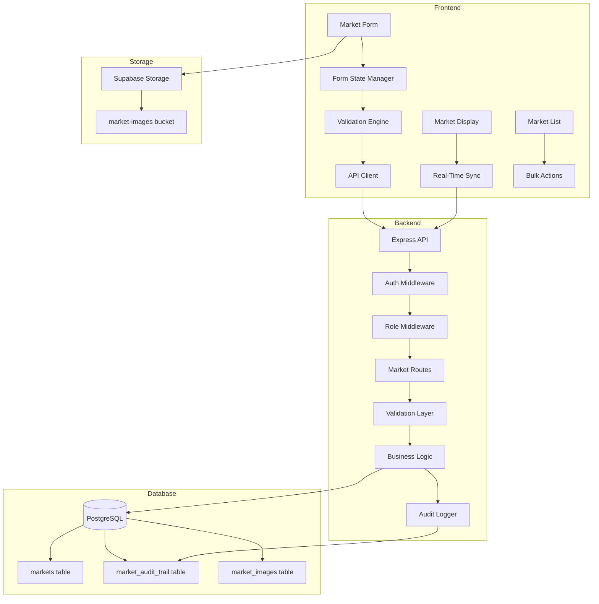
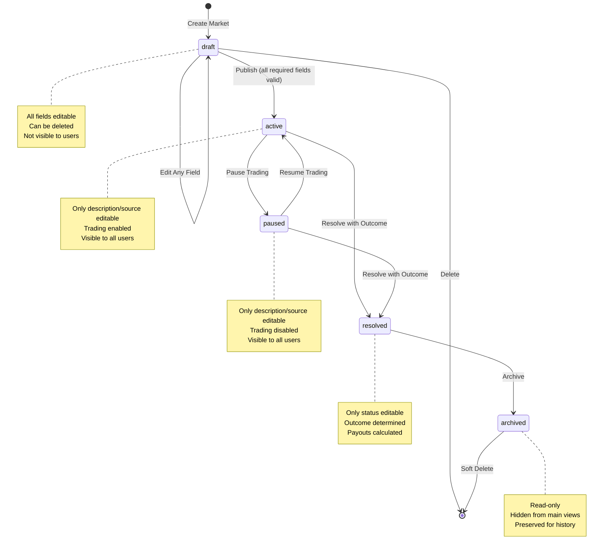
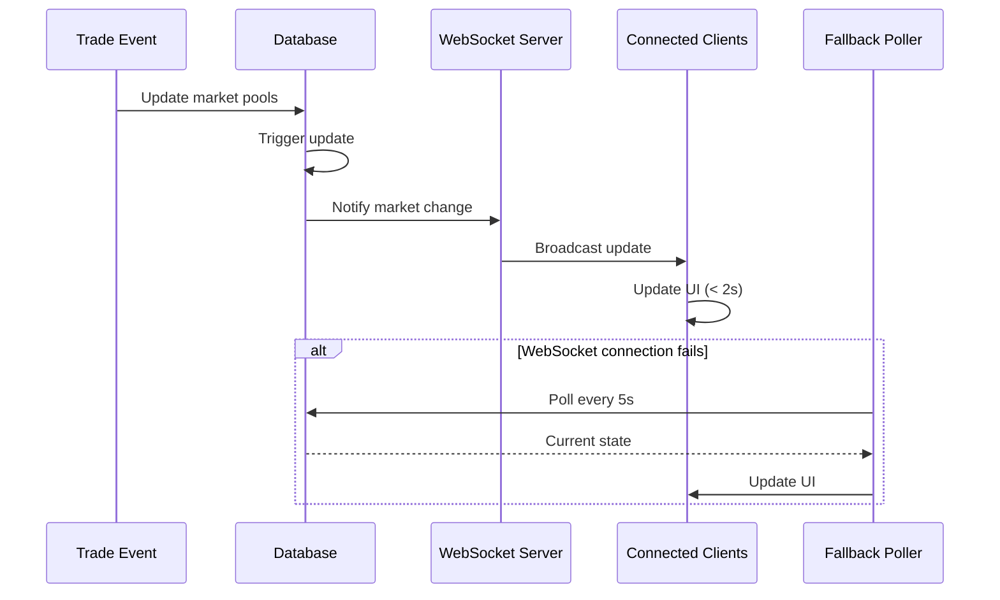

# Design Document: Admin Market Creation System

## Overview

The Admin Market Creation System provides a comprehensive administrative interface for creating, managing, and resolving prediction markets on the Flippe platform. This system enables authorized administrators to control the complete market lifecycle from draft creation through resolution and archival, with robust validation, audit trails, and real-time data synchronization.

### Key Design Goals

1. **Data Integrity**: Enforce mathematical and logical consistency at all layers (database, API, UI)
2. **Flexible Workflow**: Support draft-to-publish workflow with appropriate restrictions per lifecycle stage
3. **Real-Time Accuracy**: Ensure market displays reflect current state within 2 seconds
4. **Comprehensive Audit**: Track all administrative actions for accountability
5. **Premium UX**: Deliver a professional, accessible interface with immediate feedback

### Design Principles

- **Validation Everywhere**: Client-side for UX, server-side for security, database for integrity
- **Fail Fast**: Catch errors early with immediate feedback
- **State Machine Clarity**: Explicit status transitions with clear rules
- **Minimal Trust**: Backend validates all inputs regardless of frontend checks
- **Accessibility First**: WCAG 2.1 AA compliance for all interfaces

## Architecture

### System Components



### Market Lifecycle State Machine



### Real-Time Data Flow



## Components and Interfaces

### Database Layer

#### Markets Table Schema

```sql
CREATE TABLE markets (
  -- Identity
  id UUID PRIMARY KEY DEFAULT gen_random_uuid(),
  
  -- Core Content
  question TEXT NOT NULL,
  description TEXT,
  category VARCHAR(50) NOT NULL,
  country_filter VARCHAR(2),  -- ISO 3166-1 alpha-2 code
  
  -- Market Type
  market_type VARCHAR(20) NOT NULL DEFAULT 'binary' 
    CHECK (market_type IN ('binary', 'multiple_choice')),
  
  -- Outcome Labels (customizable)
  yes_label VARCHAR(50) NOT NULL DEFAULT 'Yes',
  no_label VARCHAR(50) NOT NULL DEFAULT 'No',
  
  -- Pricing (stored as percentages 0-100)
  yes_price DECIMAL(5,2) NOT NULL CHECK (yes_price >= 0 AND yes_price <= 100),
  no_price DECIMAL(5,2) NOT NULL CHECK (no_price >= 0 AND no_price <= 100),
  
  -- Price Consistency Constraint
  CONSTRAINT price_sum_equals_100 CHECK (yes_price + no_price = 100),
  
  -- Lifecycle Dates
  close_date TIMESTAMP NOT NULL,
  resolution_date TIMESTAMP NOT NULL,
  
  -- Date Ordering Constraint
  CONSTRAINT resolution_after_close CHECK (resolution_date > close_date),
  CONSTRAINT close_date_future CHECK (close_date > created_at),
  
  -- Resolution
  resolution_source TEXT,
  outcome VARCHAR(10) CHECK (outcome IN ('YES', 'NO', 'INVALID')),
  
  -- Status
  status VARCHAR(20) NOT NULL DEFAULT 'draft'
    CHECK (status IN ('draft', 'active', 'paused', 'resolved', 'archived')),
  
  -- Statistics (updated by trades)
  pool_amount_smallest_unit BIGINT NOT NULL DEFAULT 0,
  participant_count INTEGER NOT NULL DEFAULT 0,
  
  -- Currency
  currency VARCHAR(3) NOT NULL DEFAULT 'NGN' CHECK (currency IN ('NGN', 'USD')),
  
  -- Media
  image_url VARCHAR(500),
  
  -- Audit
  created_by UUID NOT NULL REFERENCES users(id),
  created_at TIMESTAMP NOT NULL DEFAULT CURRENT_TIMESTAMP,
  updated_at TIMESTAMP NOT NULL DEFAULT CURRENT_TIMESTAMP,
  resolved_at TIMESTAMP,
  archived_at TIMESTAMP
);

-- Indexes for performance
CREATE INDEX idx_markets_status ON markets(status);
CREATE INDEX idx_markets_category ON markets(category);
CREATE INDEX idx_markets_close_date ON markets(close_date);
CREATE INDEX idx_markets_created_at ON markets(created_at DESC);
CREATE INDEX idx_markets_country ON markets(country_filter) WHERE country_filter IS NOT NULL;

-- Partial index for active markets (most queried)
CREATE INDEX idx_markets_active ON markets(close_date) 
  WHERE status = 'active';
```

#### Market Audit Trail Table

```sql
CREATE TABLE market_audit_trail (
  id UUID PRIMARY KEY DEFAULT gen_random_uuid(),
  market_id UUID NOT NULL REFERENCES markets(id) ON DELETE CASCADE,
  
  -- Who and when
  admin_user_id UUID NOT NULL REFERENCES users(id),
  action_timestamp TIMESTAMP NOT NULL DEFAULT CURRENT_TIMESTAMP,
  
  -- What happened
  action_type VARCHAR(20) NOT NULL 
    CHECK (action_type IN ('create', 'update', 'status_change', 'delete')),
  
  -- Changed data (JSONB for flexibility)
  changed_fields JSONB,  -- { "field_name": { "old": value, "new": value } }
  
  -- Full snapshot for critical actions
  snapshot_before JSONB,
  snapshot_after JSONB,
  
  -- Context
  ip_address INET,
  user_agent TEXT
);

-- Indexes
CREATE INDEX idx_audit_market_id ON market_audit_trail(market_id);
CREATE INDEX idx_audit_admin_user ON market_audit_trail(admin_user_id);
CREATE INDEX idx_audit_timestamp ON market_audit_trail(action_timestamp DESC);
CREATE INDEX idx_audit_action_type ON market_audit_trail(action_type);

-- Immutability: Prevent updates and deletes
CREATE RULE audit_trail_immutable_update AS 
  ON UPDATE TO market_audit_trail DO INSTEAD NOTHING;
CREATE RULE audit_trail_immutable_delete AS 
  ON DELETE TO market_audit_trail DO INSTEAD NOTHING;
```

#### Database Triggers

```sql
-- Auto-update updated_at timestamp
CREATE OR REPLACE FUNCTION update_updated_at_column()
RETURNS TRIGGER AS $$
BEGIN
  NEW.updated_at = CURRENT_TIMESTAMP;
  RETURN NEW;
END;
$$ LANGUAGE plpgsql;

CREATE TRIGGER markets_updated_at
  BEFORE UPDATE ON markets
  FOR EACH ROW
  EXECUTE FUNCTION update_updated_at_column();

-- Auto-set resolved_at when status changes to resolved
CREATE OR REPLACE FUNCTION set_resolved_at()
RETURNS TRIGGER AS $$
BEGIN
  IF NEW.status = 'resolved' AND OLD.status != 'resolved' THEN
    NEW.resolved_at = CURRENT_TIMESTAMP;
  END IF;
  RETURN NEW;
END;
$$ LANGUAGE plpgsql;

CREATE TRIGGER markets_resolved_at
  BEFORE UPDATE ON markets
  FOR EACH ROW
  EXECUTE FUNCTION set_resolved_at();

-- Auto-set archived_at when status changes to archived
CREATE OR REPLACE FUNCTION set_archived_at()
RETURNS TRIGGER AS $$
BEGIN
  IF NEW.status = 'archived' AND OLD.status != 'archived' THEN
    NEW.archived_at = CURRENT_TIMESTAMP;
  END IF;
  RETURN NEW;
END;
$$ LANGUAGE plpgsql;

CREATE TRIGGER markets_archived_at
  BEFORE UPDATE ON markets
  FOR EACH ROW
  EXECUTE FUNCTION set_archived_at();
```

### Backend Layer

#### API Endpoints

**Market CRUD Operations:**

```typescript
// Create market (admin/super_admin only)
POST /api/admin/markets
Headers: { Cookie: auth_token }
Body: {
  question: string;
  description?: string;
  category: string;
  country_filter?: string;
  market_type: 'binary' | 'multiple_choice';
  yes_label?: string;
  no_label?: string;
  yes_price: number;  // 0-100
  no_price: number;   // 0-100
  close_date: string; // ISO 8601
  resolution_date: string; // ISO 8601
  resolution_source?: string;
  status: 'draft' | 'active';
  currency: 'NGN' | 'USD';
  image_url?: string;
}
Response: {
  success: boolean;
  market: Market;
}
Errors: 
  400 - Validation error (prices don't sum to 100, invalid dates, etc.)
  401 - Not authenticated
  403 - Not admin/super_admin
  500 - Server error

// Get market details
GET /api/markets/:marketId
Response: {
  market: Market & {
    pool_amount: number;
    participant_count: number;
    current_yes_percentage: number;
    current_no_percentage: number;
    time_remaining_seconds: number;
  }
}
Errors:
  404 - Market not found

// Update market (admin/super_admin only)
PUT /api/admin/markets/:marketId
Headers: { Cookie: auth_token }
Body: Partial<MarketCreateBody>
Response: {
  success: boolean;
  market: Market;
}
Errors:
  400 - Validation error or invalid edit for status
  401 - Not authenticated
  403 - Not admin/super_admin
  404 - Market not found
  409 - Conflict (e.g., editing locked fields on active market)

// Delete market (admin/super_admin only, draft only)
DELETE /api/admin/markets/:marketId
Headers: { Cookie: auth_token }
Response: {
  success: boolean;
  message: string;
}
Errors:
  400 - Cannot delete non-draft market
  401 - Not authenticated
  403 - Not admin/super_admin
  404 - Market not found

// List markets with filters
GET /api/admin/markets
Query: {
  status?: 'draft' | 'active' | 'paused' | 'resolved' | 'archived';
  category?: string;
  search?: string;  // Searches question field
  sort?: 'close_date' | 'pool_amount' | 'created_at';
  order?: 'asc' | 'desc';
  page?: number;
  limit?: number;
}
Response: {
  markets: Market[];
  pagination: {
    total: number;
    page: number;
    limit: number;
    pages: number;
  }
}
```

**Market Status Operations:**

```typescript
// Change market status (admin/super_admin only)
PATCH /api/admin/markets/:marketId/status
Headers: { Cookie: auth_token }
Body: {
  status: 'draft' | 'active' | 'paused' | 'resolved' | 'archived';
  outcome?: 'YES' | 'NO' | 'INVALID';  // Required if status = 'resolved'
  resolution_source?: string;  // Required if status = 'resolved'
}
Response: {
  success: boolean;
  market: Market;
}
Errors:
  400 - Invalid status transition or missing required fields
  401 - Not authenticated
  403 - Not admin/super_admin
  404 - Market not found

// Bulk status change (admin/super_admin only)
PATCH /api/admin/markets/bulk-status
Headers: { Cookie: auth_token }
Body: {
  market_ids: string[];
  status: 'paused' | 'archived';
}
Response: {
  success: boolean;
  updated_count: number;
  failed: Array<{ market_id: string; error: string }>;
}
Errors:
  400 - Invalid bulk operation
  401 - Not authenticated
  403 - Not admin/super_admin
```

**Image Upload:**

```typescript
// Upload market image (admin/super_admin only)
POST /api/admin/markets/upload-image
Headers: { 
  Cookie: auth_token;
  Content-Type: multipart/form-data;
}
Body: FormData with 'image' field
Response: {
  success: boolean;
  image_url: string;
}
Errors:
  400 - Invalid file type or size > 5MB
  401 - Not authenticated
  403 - Not admin/super_admin
  500 - Upload failed
```

**Audit Trail:**

```typescript
// Get market audit trail (admin/super_admin only)
GET /api/admin/markets/:marketId/audit
Headers: { Cookie: auth_token }
Query: {
  page?: number;
  limit?: number;
}
Response: {
  audit_entries: Array<{
    id: string;
    admin_user: { id: string; username: string; email: string };
    action_timestamp: string;
    action_type: string;
    changed_fields: Record<string, { old: any; new: any }>;
  }>;
  pagination: PaginationInfo;
}
Errors:
  401 - Not authenticated
  403 - Not admin/super_admin
  404 - Market not found
```

**Data Export:**

```typescript
// Export markets to CSV (admin/super_admin only)
GET /api/admin/markets/export
Headers: { Cookie: auth_token }
Query: Same as list markets filters
Response: CSV file download
Headers: {
  Content-Type: 'text/csv';
  Content-Disposition: 'attachment; filename="markets-export-{timestamp}.csv"';
}
Errors:
  401 - Not authenticated
  403 - Not admin/super_admin
```

#### Validation Layer

```typescript
// Market validation schemas (using Zod)
const MarketCreateSchema = z.object({
  question: z.string().min(10).max(500),
  description: z.string().max(5000).optional(),
  category: z.string().min(1),
  country_filter: z.string().length(2).optional(),
  market_type: z.enum(['binary', 'multiple_choice']),
  yes_label: z.string().max(50).default('Yes'),
  no_label: z.string().max(50).default('No'),
  yes_price: z.number().min(0).max(100),
  no_price: z.number().min(0).max(100),
  close_date: z.string().datetime(),
  resolution_date: z.string().datetime(),
  resolution_source: z.string().max(1000).optional(),
  status: z.enum(['draft', 'active']),
  currency: z.enum(['NGN', 'USD']),
  image_url: z.string().url().max(500).optional(),
}).refine(
  (data) => data.yes_price + data.no_price === 100,
  { message: 'YES and NO prices must sum to 100', path: ['yes_price'] }
).refine(
  (data) => new Date(data.close_date) > new Date(),
  { message: 'Close date must be in the future', path: ['close_date'] }
).refine(
  (data) => new Date(data.resolution_date) > new Date(data.close_date),
  { message: 'Resolution date must be after close date', path: ['resolution_date'] }
);

// Status transition validation
const VALID_TRANSITIONS: Record<string, string[]> = {
  draft: ['active', 'draft'],  // Can stay draft or publish
  active: ['paused', 'resolved'],
  paused: ['active', 'resolved'],
  resolved: ['archived'],
  archived: [],  // Terminal state
};

function isValidTransition(from: string, to: string): boolean {
  return VALID_TRANSITIONS[from]?.includes(to) ?? false;
}

// Edit restrictions by status
const EDITABLE_FIELDS_BY_STATUS: Record<string, string[]> = {
  draft: ['*'],  // All fields editable
  active: ['description', 'resolution_source'],
  paused: ['description', 'resolution_source'],
  resolved: ['status'],  // Only status change to archived
  archived: [],  // No edits allowed
};

function canEditField(status: string, field: string): boolean {
  const allowed = EDITABLE_FIELDS_BY_STATUS[status];
  return allowed?.includes('*') || allowed?.includes(field) || false;
}
```

### Frontend Layer

#### Form State Management

```typescript
// Market form state
interface MarketFormState {
  // Form data
  data: {
    question: string;
    description: string;
    category: string;
    country_filter: string;
    market_type: 'binary' | 'multiple_choice';
    yes_label: string;
    no_label: string;
    yes_price: number;
    no_price: number;
    close_date: string;
    resolution_date: string;
    resolution_source: string;
    status: 'draft' | 'active';
    currency: 'NGN' | 'USD';
    image_url: string;
  };
  
  // Validation state
  errors: Partial<Record<keyof MarketFormState['data'], string>>;
  touched: Partial<Record<keyof MarketFormState['data'], boolean>>;
  
  // UI state
  isSubmitting: boolean;
  isDirty: boolean;
  lastSaved: Date | null;
  autoSaveEnabled: boolean;
  
  // Preview
  showPreview: boolean;
}

// Form actions
type MarketFormAction =
  | { type: 'SET_FIELD'; field: string; value: any }
  | { type: 'SET_ERROR'; field: string; error: string }
  | { type: 'CLEAR_ERROR'; field: string }
  | { type: 'TOUCH_FIELD'; field: string }
  | { type: 'SET_SUBMITTING'; value: boolean }
  | { type: 'MARK_SAVED'; timestamp: Date }
  | { type: 'RESET_FORM' }
  | { type: 'LOAD_MARKET'; market: Market }
  | { type: 'TOGGLE_PREVIEW' };

// Auto-save hook
function useAutoSave(formState: MarketFormState, interval: number = 30000) {
  useEffect(() => {
    if (!formState.isDirty || !formState.autoSaveEnabled) return;
    
    const timer = setTimeout(async () => {
      try {
        await saveDraft(formState.data);
        dispatch({ type: 'MARK_SAVED', timestamp: new Date() });
      } catch (error) {
        console.error('Auto-save failed:', error);
      }
    }, interval);
    
    return () => clearTimeout(timer);
  }, [formState.data, formState.isDirty, interval]);
}

// Local storage persistence
function useFormPersistence(marketId: string | null) {
  const storageKey = `market-form-${marketId || 'new'}`;
  
  // Load from storage on mount
  useEffect(() => {
    const saved = localStorage.getItem(storageKey);
    if (saved) {
      const data = JSON.parse(saved);
      dispatch({ type: 'LOAD_MARKET', market: data });
    }
  }, []);
  
  // Save to storage on change
  useEffect(() => {
    localStorage.setItem(storageKey, JSON.stringify(formState.data));
  }, [formState.data]);
  
  // Clear on successful submit
  const clearStorage = () => localStorage.removeItem(storageKey);
  
  return { clearStorage };
}
```

#### Real-Time Sync Component

```typescript
// WebSocket connection for real-time updates
function useMarketRealTimeSync(marketId: string) {
  const [marketData, setMarketData] = useState<MarketStats | null>(null);
  const [connectionStatus, setConnectionStatus] = useState<'connected' | 'disconnected' | 'fallback'>('disconnected');
  
  useEffect(() => {
    // Try WebSocket connection
    const ws = new WebSocket(`${WS_URL}/markets/${marketId}`);
    
    ws.onopen = () => {
      setConnectionStatus('connected');
    };
    
    ws.onmessage = (event) => {
      const update = JSON.parse(event.data);
      setMarketData(update);
    };
    
    ws.onerror = () => {
      setConnectionStatus('fallback');
      ws.close();
    };
    
    ws.onclose = () => {
      setConnectionStatus('fallback');
    };
    
    // Fallback polling
    let pollInterval: NodeJS.Timeout;
    if (connectionStatus === 'fallback') {
      pollInterval = setInterval(async () => {
        try {
          const response = await fetch(`/api/markets/${marketId}`);
          const data = await response.json();
          setMarketData(data.market);
        } catch (error) {
          console.error('Polling failed:', error);
        }
      }, 5000);
    }
    
    return () => {
      ws.close();
      if (pollInterval) clearInterval(pollInterval);
    };
  }, [marketId, connectionStatus]);
  
  return { marketData, connectionStatus };
}
```

#### Validation Feedback Component

```typescript
// Real-time validation with debouncing
function useFieldValidation(
  field: string,
  value: any,
  validator: (val: any) => string | null,
  debounceMs: number = 300
) {
  const [error, setError] = useState<string | null>(null);
  const [isValidating, setIsValidating] = useState(false);
  
  useEffect(() => {
    setIsValidating(true);
    const timer = setTimeout(() => {
      const validationError = validator(value);
      setError(validationError);
      setIsValidating(false);
    }, debounceMs);
    
    return () => clearTimeout(timer);
  }, [value, validator, debounceMs]);
  
  return { error, isValidating };
}

// Price sum validator
function usePriceSumValidation(yesPrice: number, noPrice: number) {
  const sum = yesPrice + noPrice;
  const error = sum !== 100 ? `Prices must sum to 100 (currently ${sum})` : null;
  
  return { error, sum };
}

// Date validator
function useDateValidation(closeDate: string, resolutionDate: string) {
  const close = new Date(closeDate);
  const resolution = new Date(resolutionDate);
  const now = new Date();
  
  const errors = {
    closeDate: close <= now ? 'Close date must be in the future' : null,
    resolutionDate: resolution <= close ? 'Resolution date must be after close date' : null,
  };
  
  return errors;
}
```

## Data Models

### TypeScript Interfaces

```typescript
// Core market model
interface Market {
  id: string;
  question: string;
  description: string | null;
  category: string;
  country_filter: string | null;
  market_type: 'binary' | 'multiple_choice';
  yes_label: string;
  no_label: string;
  yes_price: number;
  no_price: number;
  close_date: string;
  resolution_date: string;
  resolution_source: string | null;
  outcome: 'YES' | 'NO' | 'INVALID' | null;
  status: 'draft' | 'active' | 'paused' | 'resolved' | 'archived';
  pool_amount_smallest_unit: number;
  participant_count: number;
  currency: 'NGN' | 'USD';
  image_url: string | null;
  created_by: string;
  created_at: string;
  updated_at: string;
  resolved_at: string | null;
  archived_at: string | null;
}

// Market with computed fields for display
interface MarketDisplay extends Market {
  pool_amount: number;  // Converted from smallest unit
  current_yes_percentage: number;
  current_no_percentage: number;
  time_remaining_seconds: number;
  is_closing_soon: boolean;  // < 24 hours
  is_closed: boolean;
}

// Audit trail entry
interface AuditEntry {
  id: string;
  market_id: string;
  admin_user_id: string;
  admin_user: {
    id: string;
    username: string;
    email: string;
  };
  action_timestamp: string;
  action_type: 'create' | 'update' | 'status_change' | 'delete';
  changed_fields: Record<string, { old: any; new: any }>;
  snapshot_before: Market | null;
  snapshot_after: Market | null;
  ip_address: string | null;
  user_agent: string | null;
}

// Market list filters
interface MarketFilters {
  status?: Market['status'];
  category?: string;
  search?: string;
  sort?: 'close_date' | 'pool_amount' | 'created_at';
  order?: 'asc' | 'desc';
  page?: number;
  limit?: number;
}

// Bulk action request
interface BulkActionRequest {
  market_ids: string[];
  action: 'pause' | 'archive';
}

// CSV export row
interface MarketExportRow {
  id: string;
  question: string;
  category: string;
  status: string;
  close_date: string;
  resolution_date: string;
  pool_amount: number;
  participant_count: number;
  outcome: string;
  created_at: string;
  resolved_at: string;
}
```

## Correctness Properties

*A property is a characteristic or behavior that should hold true across all valid executions of a system—essentially, a formal statement about what the system should do. Properties serve as the bridge between human-readable specifications and machine-verifiable correctness guarantees.*


### Property Reflection

After analyzing all acceptance criteria, I identified the following redundancies and consolidations:

**Redundancies Eliminated:**
- Requirements 2.2, 2.3 are redundant with 2.1 (all test the same price sum validation)
- Requirements 3.3, 3.4 are redundant with 3.1, 3.2 (same date validation rules)
- Requirement 8.3 is redundant with 8.2 (inverse of allowed fields)
- Requirements 12.1-12.4 can be combined into one property about display completeness
- Requirements 18.4 and 18.5 can be combined into one property about API authorization
- Requirements 20.3 and 20.4 can be combined with 2.5 and 2.6 (same price range validation)

**Properties Combined:**
- Price validation (2.1, 2.4, 2.5, 2.6) → Single comprehensive price validation property
- Date validation (3.1, 3.2, 3.5) → Single comprehensive date validation property
- Edit restrictions (8.1, 8.2, 8.4, 8.5) → Single property about status-based editing rules
- Audit trail logging (19.1, 19.2, 19.3, 19.4) → Single property about comprehensive audit logging
- Admin authorization (18.1, 18.2, 18.3, 18.4, 18.5) → Single property about role-based access control

### Property 1: Price Sum Invariant

*For any* market with YES_Price and NO_Price values, the sum of YES_Price and NO_Price must equal exactly 100, and both prices must be between 0 and 100 inclusive.

**Validates: Requirements 2.1, 2.4, 2.5, 2.6, 20.3, 20.4**

### Property 2: Date Ordering Invariant

*For any* market, the close_date must be in the future relative to creation time, and the resolution_date must be after the close_date.

**Validates: Requirements 3.1, 3.2, 3.5, 20.5**

### Property 3: Required Field Validation

*For any* market submission, the system must reject the submission if any required field (question, category, yes_price, no_price, close_date, resolution_date) is empty or null.

**Validates: Requirements 4.3, 4.4, 4.5, 20.1, 20.2**

### Property 4: Draft Status Persistence

*For any* market saved with status 'draft', the database must store the market with status 'draft' and the market must not be visible to non-admin users.

**Validates: Requirements 6.2, 7.3**

### Property 5: Active Market Validation

*For any* market being published with status 'active', the system must validate all required fields before allowing the status change.

**Validates: Requirements 7.1, 7.2**

### Property 6: Status-Based Edit Restrictions

*For any* market being edited, the system must enforce field edit restrictions based on current status: draft allows all fields, active/paused allow only description and resolution_source, resolved allows only status, and archived allows no edits.

**Validates: Requirements 8.1, 8.2, 8.4, 8.5**

### Property 7: Valid Status Transitions

*For any* market status change, the system must only allow valid transitions: draft→active, active→paused, paused→active, active→resolved, paused→resolved, resolved→archived.

**Validates: Requirements 9.1, 9.2, 9.3, 9.4**

### Property 8: Draft-Only Deletion

*For any* market deletion request, the system must only allow deletion if the market status is 'draft', and must reject deletion for all other statuses.

**Validates: Requirements 10.3**

### Property 9: Image Type Validation

*For any* image upload, the system must validate that the file is an image format (JPEG, PNG, GIF, WebP) and reject non-image files.

**Validates: Requirements 11.1**

### Property 10: Image Size Validation

*For any* image upload, the system must validate that the file size is under 5MB and reject larger files.

**Validates: Requirements 11.2**

### Property 11: Image Upload Round Trip

*For any* valid image upload, the system must store the image and return a valid URL that can be used to retrieve the same image.

**Validates: Requirements 11.3**

### Property 12: Countdown Display Logic

*For any* market where close_date is in the future, the display must show a countdown timer formatted as days, hours, minutes, and seconds.

**Validates: Requirements 13.1, 13.3**

### Property 13: Resolution Source URL Detection

*For any* resolution_source value, if it matches URL format (starts with http:// or https://), the system must render it as a clickable link; otherwise, render as plain text.

**Validates: Requirements 14.3, 14.4**

### Property 14: Search Filtering

*For any* search query on the market list, the system must return only markets where the question field contains the search term (case-insensitive).

**Validates: Requirements 15.3**

### Property 15: Status and Category Filtering

*For any* filter selection (status or category), the system must return only markets matching the selected filter value.

**Validates: Requirements 15.4**

### Property 16: Sorting Consistency

*For any* sort option (close_date, pool_amount, created_at) and order (asc/desc), the system must return markets in the specified order.

**Validates: Requirements 15.5**

### Property 17: Bulk Pause Authorization

*For any* bulk pause operation, the system must only allow pausing markets with status 'active' and must reject the operation for markets in other statuses.

**Validates: Requirements 16.3**

### Property 18: Bulk Archive Authorization

*For any* bulk archive operation, the system must only allow archiving markets with status 'resolved' and must reject the operation for markets in other statuses.

**Validates: Requirements 16.4**

### Property 19: CSV Export Completeness

*For any* CSV export, the file must include all required columns: Market_Question, Category, Market_Status, Close_Date, Resolution_Date, Pool_Amount, and Participant_Count.

**Validates: Requirements 17.2, 17.3**

### Property 20: Filtered Export Consistency

*For any* CSV export with active filters, the exported data must include only markets matching the current filter and search criteria.

**Validates: Requirements 17.5**

### Property 21: Admin-Only Access Control

*For any* user attempting to access market management endpoints (create, update, delete, status change), the system must verify the user has role 'admin' or 'super_admin' and reject requests from users with role 'user'.

**Validates: Requirements 18.1, 18.2, 18.3, 18.4, 18.5**

### Property 22: Comprehensive Audit Logging

*For any* market operation (create, update, status change, delete), the system must create an audit trail entry recording the admin user ID, timestamp, action type, and changed fields with old and new values.

**Validates: Requirements 19.1, 19.2, 19.3, 19.4**

### Property 23: Audit Trail Immutability

*For any* audit trail entry, once created, the system must prevent any updates or deletions to maintain an immutable audit history.

**Validates: Requirements 19.5**

### Property 24: Form State Persistence

*For any* draft market form with unsaved changes, if the browser is closed and reopened, the system must restore the form state from local storage.

**Validates: Requirements 22.2**

### Property 25: Form State Preservation on Error

*For any* form submission that fails, the system must preserve all entered field values so the user can correct errors without re-entering data.

**Validates: Requirements 22.4**

### Property 26: Form Initialization from Market Data

*For any* existing market being edited, the system must populate all form fields with the current market values from the database.

**Validates: Requirements 22.5**

### Property 27: Resolution Source Requirement

*For any* market being resolved, the system must require the resolution_source field to be populated before allowing the resolution to proceed.

**Validates: Requirements 30.2**

### Property 28: Resolution Status Update

*For any* market resolution submission, the system must update the market status to 'resolved' and store the selected outcome (YES, NO, or INVALID).

**Validates: Requirements 30.3**

### Property 29: Resolution Triggers Payouts

*For any* market that is successfully resolved, the system must trigger payout calculations for all participants based on the outcome.

**Validates: Requirements 30.4**

## Error Handling

### Error Response Format

All API errors follow a consistent JSON format:

```typescript
{
  success: false;
  error: {
    code: string;           // Machine-readable error code
    message: string;        // Human-readable error message
    field?: string;         // Field name for validation errors
    details?: any;          // Additional error context
  }
}
```

### Error Codes and HTTP Status Codes

**Validation Errors (400 Bad Request):**
- `VALIDATION_ERROR`: Generic validation failure
- `PRICE_SUM_INVALID`: YES_Price + NO_Price ≠ 100
- `PRICE_OUT_OF_RANGE`: Price not between 0-100
- `INVALID_DATE_ORDER`: Resolution date not after close date
- `CLOSE_DATE_NOT_FUTURE`: Close date not in future
- `REQUIRED_FIELD_MISSING`: Required field empty or null
- `INVALID_STATUS_TRANSITION`: Attempted invalid status change
- `INVALID_IMAGE_TYPE`: Uploaded file not an image
- `IMAGE_TOO_LARGE`: Image file exceeds 5MB
- `CANNOT_DELETE_NON_DRAFT`: Attempted to delete non-draft market
- `CANNOT_EDIT_FIELD`: Attempted to edit locked field for status
- `RESOLUTION_SOURCE_REQUIRED`: Resolving without resolution source

**Authentication Errors (401 Unauthorized):**
- `UNAUTHORIZED`: No authentication token provided
- `INVALID_TOKEN`: JWT token expired or malformed
- `SESSION_EXPIRED`: User session has expired

**Authorization Errors (403 Forbidden):**
- `FORBIDDEN`: User lacks required role (not admin/super_admin)
- `INSUFFICIENT_PERMISSIONS`: User cannot perform this action

**Not Found Errors (404 Not Found):**
- `MARKET_NOT_FOUND`: Market ID does not exist
- `USER_NOT_FOUND`: User ID does not exist

**Conflict Errors (409 Conflict):**
- `MARKET_ALREADY_RESOLVED`: Attempted to resolve already-resolved market
- `CONCURRENT_MODIFICATION`: Market modified by another admin

**Server Errors (500 Internal Server Error):**
- `DATABASE_ERROR`: Database operation failed
- `UPLOAD_FAILED`: Image upload to storage failed
- `INTERNAL_ERROR`: Unexpected server error

### Error Handling Strategy

**Frontend Error Handling:**

```typescript
// Centralized error handler
function handleApiError(error: ApiError) {
  switch (error.code) {
    case 'VALIDATION_ERROR':
      // Show field-specific error
      setFieldError(error.field, error.message);
      break;
    
    case 'UNAUTHORIZED':
    case 'SESSION_EXPIRED':
      // Redirect to login
      clearAuthState();
      navigate('/login');
      break;
    
    case 'FORBIDDEN':
      // Show unauthorized page
      navigate('/unauthorized');
      break;
    
    case 'MARKET_NOT_FOUND':
      // Show 404 page
      navigate('/404');
      break;
    
    default:
      // Show toast notification
      showToast({
        type: 'error',
        message: error.message || 'An unexpected error occurred',
      });
  }
}

// Form submission with error handling
async function submitMarket(data: MarketFormData) {
  try {
    setIsSubmitting(true);
    const response = await api.post('/admin/markets', data);
    showToast({ type: 'success', message: 'Market created successfully' });
    navigate(`/admin/markets/${response.market.id}`);
  } catch (error) {
    handleApiError(error);
  } finally {
    setIsSubmitting(false);
  }
}
```

**Backend Error Handling:**

```typescript
// Validation error middleware
function validateMarket(req: Request, res: Response, next: NextFunction) {
  try {
    const validated = MarketCreateSchema.parse(req.body);
    req.body = validated;
    next();
  } catch (error) {
    if (error instanceof z.ZodError) {
      const firstError = error.errors[0];
      return res.status(400).json({
        success: false,
        error: {
          code: 'VALIDATION_ERROR',
          message: firstError.message,
          field: firstError.path.join('.'),
          details: error.errors,
        },
      });
    }
    next(error);
  }
}

// Database constraint error handling
function handleDatabaseError(error: any): ApiError {
  if (error.code === '23514') {  // CHECK constraint violation
    if (error.constraint === 'price_sum_equals_100') {
      return {
        code: 'PRICE_SUM_INVALID',
        message: 'YES and NO prices must sum to 100',
      };
    }
    if (error.constraint === 'resolution_after_close') {
      return {
        code: 'INVALID_DATE_ORDER',
        message: 'Resolution date must be after close date',
      };
    }
  }
  
  if (error.code === '23502') {  // NOT NULL violation
    return {
      code: 'REQUIRED_FIELD_MISSING',
      message: `Required field ${error.column} is missing`,
      field: error.column,
    };
  }
  
  return {
    code: 'DATABASE_ERROR',
    message: 'A database error occurred',
  };
}

// Global error handler
app.use((error: any, req: Request, res: Response, next: NextFunction) => {
  console.error('Error:', error);
  
  // Log to audit trail for admin actions
  if (req.user && req.user.role !== 'user') {
    logAuditEntry({
      admin_user_id: req.user.id,
      action_type: 'error',
      error: error.message,
      ip_address: req.ip,
      user_agent: req.headers['user-agent'],
    });
  }
  
  const apiError = error.code ? error : handleDatabaseError(error);
  
  res.status(error.statusCode || 500).json({
    success: false,
    error: apiError,
  });
});
```

### Validation Feedback Timing

**Real-Time Validation (< 500ms):**
- Price sum validation (triggered on YES or NO price change)
- Date ordering validation (triggered on date selection)
- Required field validation (triggered on blur)
- Image type/size validation (triggered on file selection)

**Debounced Validation (300ms):**
- Question length validation (10-500 chars)
- Description length validation (max 5000 chars)
- Resolution source length validation (max 1000 chars)

**Submission Validation:**
- All validations re-run on form submission
- Backend validation as final check
- Database constraints as last line of defense

### Concurrent Modification Handling

```typescript
// Optimistic locking with version field
interface Market {
  // ... other fields
  version: number;  // Incremented on each update
}

// Update with version check
async function updateMarket(id: string, data: Partial<Market>, expectedVersion: number) {
  const result = await db.query(
    `UPDATE markets 
     SET ..., version = version + 1, updated_at = NOW()
     WHERE id = $1 AND version = $2
     RETURNING *`,
    [id, expectedVersion]
  );
  
  if (result.rowCount === 0) {
    throw new ApiError({
      code: 'CONCURRENT_MODIFICATION',
      message: 'Market was modified by another admin. Please refresh and try again.',
      statusCode: 409,
    });
  }
  
  return result.rows[0];
}
```

## Testing Strategy

### Dual Testing Approach

This feature requires both unit tests and property-based tests for comprehensive coverage:

**Unit Tests** focus on:
- Specific examples (e.g., creating a market with valid data)
- Edge cases (e.g., close date exactly at midnight, prices at boundaries 0 and 100)
- Error conditions (e.g., 401, 403, 404 responses)
- Integration points (e.g., database triggers, audit trail creation)
- UI components (e.g., form rendering, validation feedback display)

**Property-Based Tests** focus on:
- Universal properties across all inputs (e.g., price sum always equals 100)
- Authorization rules for all role combinations
- Status transition validity for all possible transitions
- Comprehensive input coverage through randomization
- Invariant preservation (e.g., audit trail immutability)

### Property-Based Testing Configuration

**Framework:** fast-check (for TypeScript/JavaScript)

**Configuration:**
- Minimum 100 iterations per property test
- Each test tagged with reference to design property
- Tag format: `Feature: admin-market-creation-system, Property {number}: {property_text}`

**Example Property Test Structure:**

```typescript
import fc from 'fast-check';
import { describe, test, expect } from 'vitest';

// Feature: admin-market-creation-system, Property 1: Price Sum Invariant
describe('Property 1: Price Sum Invariant', () => {
  test('YES_Price + NO_Price must always equal 100', async () => {
    await fc.assert(
      fc.asyncProperty(
        fc.integer({ min: 0, max: 100 }),  // YES_Price
        async (yesPrice) => {
          const noPrice = 100 - yesPrice;
          
          // Test validation accepts this
          const validationResult = validatePrices(yesPrice, noPrice);
          expect(validationResult.isValid).toBe(true);
          
          // Test database accepts this
          const market = await createMarket({
            ...validMarketData,
            yes_price: yesPrice,
            no_price: noPrice,
          });
          expect(market.yes_price + market.no_price).toBe(100);
        }
      ),
      { numRuns: 100 }
    );
  });
  
  test('Invalid price sums must be rejected', async () => {
    await fc.assert(
      fc.asyncProperty(
        fc.integer({ min: 0, max: 100 }),  // YES_Price
        fc.integer({ min: 0, max: 100 }),  // NO_Price
        async (yesPrice, noPrice) => {
          fc.pre(yesPrice + noPrice !== 100);  // Only test invalid sums
          
          // Test validation rejects this
          const validationResult = validatePrices(yesPrice, noPrice);
          expect(validationResult.isValid).toBe(false);
          expect(validationResult.error).toContain('must sum to 100');
          
          // Test database rejects this
          await expect(
            createMarket({
              ...validMarketData,
              yes_price: yesPrice,
              no_price: noPrice,
            })
          ).rejects.toThrow('PRICE_SUM_INVALID');
        }
      ),
      { numRuns: 100 }
    );
  });
});

// Feature: admin-market-creation-system, Property 2: Date Ordering Invariant
describe('Property 2: Date Ordering Invariant', () => {
  test('resolution_date must always be after close_date', async () => {
    await fc.assert(
      fc.asyncProperty(
        fc.date({ min: new Date(), max: new Date('2030-01-01') }),  // close_date
        fc.integer({ min: 1, max: 365 }),  // days to add for resolution
        async (closeDate, daysToAdd) => {
          const resolutionDate = new Date(closeDate);
          resolutionDate.setDate(resolutionDate.getDate() + daysToAdd);
          
          // Test validation accepts this
          const validationResult = validateDates(closeDate, resolutionDate);
          expect(validationResult.isValid).toBe(true);
          
          // Test database accepts this
          const market = await createMarket({
            ...validMarketData,
            close_date: closeDate.toISOString(),
            resolution_date: resolutionDate.toISOString(),
          });
          expect(new Date(market.resolution_date) > new Date(market.close_date)).toBe(true);
        }
      ),
      { numRuns: 100 }
    );
  });
});

// Feature: admin-market-creation-system, Property 7: Valid Status Transitions
describe('Property 7: Valid Status Transitions', () => {
  const validTransitions = [
    ['draft', 'active'],
    ['active', 'paused'],
    ['paused', 'active'],
    ['active', 'resolved'],
    ['paused', 'resolved'],
    ['resolved', 'archived'],
  ];
  
  const invalidTransitions = [
    ['draft', 'paused'],
    ['draft', 'resolved'],
    ['draft', 'archived'],
    ['active', 'draft'],
    ['active', 'archived'],
    ['paused', 'draft'],
    ['paused', 'archived'],
    ['resolved', 'draft'],
    ['resolved', 'active'],
    ['resolved', 'paused'],
    ['archived', 'draft'],
    ['archived', 'active'],
    ['archived', 'paused'],
    ['archived', 'resolved'],
  ];
  
  test('valid status transitions must be allowed', async () => {
    for (const [from, to] of validTransitions) {
      const market = await createMarketWithStatus(from);
      const updated = await updateMarketStatus(market.id, to);
      expect(updated.status).toBe(to);
    }
  });
  
  test('invalid status transitions must be rejected', async () => {
    for (const [from, to] of invalidTransitions) {
      const market = await createMarketWithStatus(from);
      await expect(
        updateMarketStatus(market.id, to)
      ).rejects.toThrow('INVALID_STATUS_TRANSITION');
    }
  });
});

// Feature: admin-market-creation-system, Property 21: Admin-Only Access Control
describe('Property 21: Admin-Only Access Control', () => {
  test('admin and super_admin can access market management', async () => {
    await fc.assert(
      fc.asyncProperty(
        fc.constantFrom('admin', 'super_admin'),
        async (role) => {
          const user = await createUserWithRole(role);
          const token = generateAuthToken(user);
          
          // Should be able to create market
          const response = await request(app)
            .post('/api/admin/markets')
            .set('Cookie', `auth_token=${token}`)
            .send(validMarketData);
          
          expect(response.status).toBe(201);
          expect(response.body.success).toBe(true);
        }
      ),
      { numRuns: 100 }
    );
  });
  
  test('regular users cannot access market management', async () => {
    const user = await createUserWithRole('user');
    const token = generateAuthToken(user);
    
    const response = await request(app)
      .post('/api/admin/markets')
      .set('Cookie', `auth_token=${token}`)
      .send(validMarketData);
    
    expect(response.status).toBe(403);
    expect(response.body.error.code).toBe('FORBIDDEN');
  });
});
```

### Unit Test Coverage Requirements

**Backend:**
- API routes: 100% coverage (critical security component)
- Validation layer: 100% coverage
- Business logic: 90% coverage
- Database queries: 90% coverage
- Audit logging: 100% coverage

**Frontend:**
- Form validation: 100% coverage
- State management: 90% coverage
- API client: 90% coverage
- UI components: 70% coverage (visual components less critical)

### Integration Testing Scenarios

**Complete Market Lifecycle:**
1. Admin creates draft market
2. Admin edits draft (all fields)
3. Admin publishes to active
4. Admin attempts to edit locked fields (should fail)
5. Admin edits allowed fields (description, resolution_source)
6. Admin pauses market
7. Admin resumes market
8. Admin resolves market with outcome
9. System triggers payouts
10. Admin archives market
11. Verify audit trail has all entries

**Concurrent Modification:**
1. Admin A loads market for editing
2. Admin B loads same market for editing
3. Admin A saves changes
4. Admin B attempts to save changes (should fail with conflict error)
5. Admin B refreshes and sees Admin A's changes
6. Admin B makes new changes and saves successfully

**Authorization Enforcement:**
1. Regular user attempts to access admin endpoints (should fail)
2. Admin creates market (should succeed)
3. Admin attempts to access super admin endpoints (should fail)
4. Super admin accesses all endpoints (should succeed)

**Real-Time Updates:**
1. User A views market display
2. Trade occurs on market
3. User A's display updates within 2 seconds
4. WebSocket connection drops
5. System falls back to polling
6. User A still receives updates every 5 seconds

### Manual Testing Checklist

**Form Validation:**
- [ ] Price sum validation shows error when sum ≠ 100
- [ ] Price sum validation clears when sum = 100
- [ ] Close date validation rejects past dates
- [ ] Resolution date validation rejects dates before close date
- [ ] Required field validation shows on submission
- [ ] Validation feedback appears within 500ms

**Status Transitions:**
- [ ] Can publish draft to active
- [ ] Can pause active market
- [ ] Can resume paused market
- [ ] Can resolve active/paused market
- [ ] Can archive resolved market
- [ ] Cannot perform invalid transitions

**Edit Restrictions:**
- [ ] Can edit all fields on draft
- [ ] Can only edit description/source on active
- [ ] Can only change status on resolved
- [ ] Cannot edit archived market

**Audit Trail:**
- [ ] Creation logged with all fields
- [ ] Updates logged with changed fields and old values
- [ ] Status changes logged with old and new status
- [ ] Deletion logged with full market snapshot
- [ ] Cannot modify or delete audit entries

**Image Upload:**
- [ ] Accepts JPEG, PNG, GIF, WebP
- [ ] Rejects non-image files
- [ ] Rejects files > 5MB
- [ ] Shows preview after successful upload
- [ ] Shows error message on failure

**Real-Time Updates:**
- [ ] Market display updates when trade occurs
- [ ] Countdown timer updates every second
- [ ] Falls back to polling when WebSocket fails
- [ ] Updates appear within 2 seconds (WebSocket)
- [ ] Updates appear within 5 seconds (polling)

**Bulk Actions:**
- [ ] Can select multiple markets
- [ ] Bulk pause only works on active markets
- [ ] Bulk archive only works on resolved markets
- [ ] Confirmation dialog shows count
- [ ] Failed operations reported individually

**Export:**
- [ ] CSV includes all required columns
- [ ] Export respects current filters
- [ ] Export respects search query
- [ ] File downloads with timestamp in name

**Accessibility:**
- [ ] All form inputs have ARIA labels
- [ ] Keyboard navigation works throughout
- [ ] Tab order is logical
- [ ] Validation errors announced to screen readers
- [ ] Color contrast meets 4.5:1 minimum

