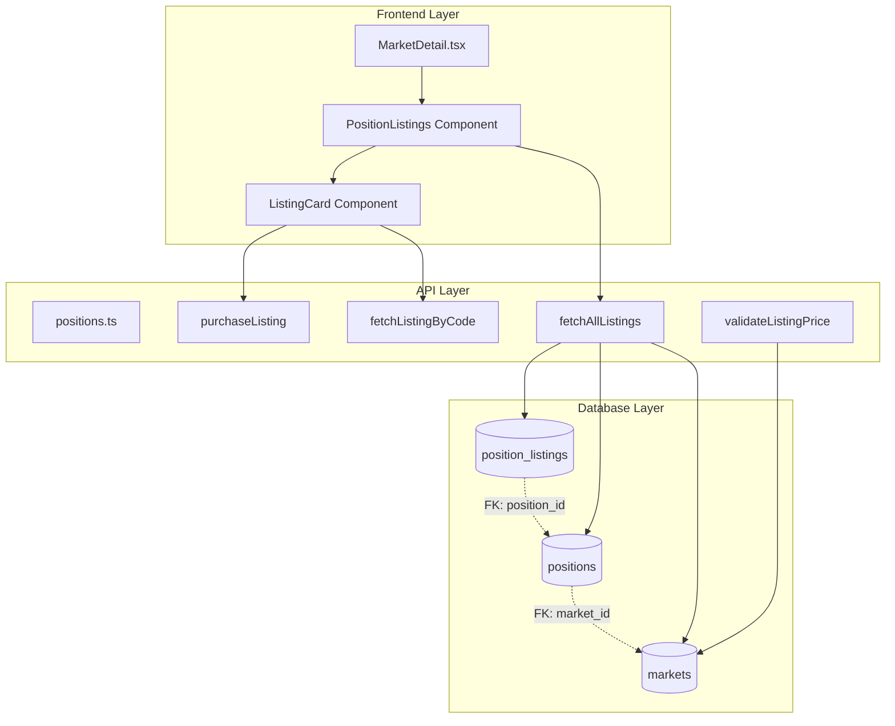

# Design Document: Market-Specific Position Listings

## Overview

This design refactors the Flippe marketplace from a standalone global page to market-specific position listings integrated directly into individual market detail pages. The refactor improves user experience by providing contextual access to secondary market positions while users are researching specific markets.

### Current State

The existing implementation features:
- Standalone `/marketplace` route displaying all position listings globally
- `Marketplace.tsx` component with search, filtering, and sorting capabilities
- `fetchAllListings()` function that retrieves all active listings without market filtering
- Position listings stored in `position_listings` table with foreign key to `positions` table
- Market information accessed through `positions.market_id` relationship

### Target State

The refactored system will:
- Display position listings within each market's detail page
- Filter listings to show only positions for the current market
- Remove the standalone marketplace route and navigation
- Maintain all existing purchase and sharing functionality
- Enforce pricing validation based on market status
- Optimize queries using existing database indexes

### Key Design Decisions

1. **Component Integration**: Create a new `PositionListings` component that can be embedded in `MarketDetail.tsx` rather than modifying the existing `Marketplace.tsx` component directly
2. **API Extension**: Extend `fetchAllListings()` with optional `marketId` parameter for backward compatibility
3. **Query Optimization**: Use database-level filtering via JOIN operations rather than client-side filtering
4. **Pricing Validation**: Implement market status-aware price validation at the API layer
5. **No Schema Changes**: Leverage existing `positions.market_id` relationship without database migrations

## Architecture

### System Components



### Data Flow

**Listing Display Flow:**
1. User navigates to market detail page with `marketId`
2. `MarketDetail.tsx` renders `PositionListings` component with `marketId` prop
3. `PositionListings` calls `fetchAllListings(marketId)`
4. API performs JOIN query: `position_listings → positions → markets`
5. Database filters by `positions.market_id = marketId` and `status = 'active'`
6. Results ordered by `created_at DESC`, limited to 100 records
7. Component renders listing cards with purchase and share actions

**Purchase Flow:**
1. User clicks buy button on listing card
2. `purchaseListing(positionId, buyerId)` called
3. System verifies buyer balance
4. Transaction updates: listing status → 'sold', position owner → buyer
5. Component re-fetches listings, purchased listing disappears

**Price Validation Flow:**
1. Seller attempts to create/update listing
2. System fetches market data including status and pool values
3. If market status is "open", validate `askingPrice <= currentMarketPrice`
4. If market status is "closed" or "resolved", allow any positive price
5. Return validation result or error message

### Component Hierarchy

```
MarketDetail.tsx
├── Header
├── Market Info Card
│   ├── Market Stats
│   ├── Price Progress Bar
│   └── Forecast Buttons
├── PositionListings (NEW)
│   ├── Section Header
│   ├── Empty State (conditional)
│   └── Listings Grid
│       └── ListingCard[] (reusable)
│           ├── Market Info
│           ├── Position Details
│           ├── Price Information
│           ├── Buy Button
│           └── Share Button
├── Source Card
└── Footer
```

## Components and Interfaces

### PositionListings Component

**Purpose:** Display market-specific position listings with purchase and sharing capabilities

**Props:**
```typescript
interface PositionListingsProps {
  marketId: string;
  marketStatus: "open" | "closed" | "resolved";
}
```

**State:**
```typescript
{
  listings: Position[];
  loading: boolean;
  error: string | null;
}
```

**Behavior:**
- Fetches listings on mount and when `marketId` changes
- Displays empty state when no listings exist
- Handles purchase flow with optimistic UI updates
- Implements share functionality with clipboard API
- Shows loading skeleton during data fetch

**Styling:**
- Matches existing `MarketDetail.tsx` design language
- Uses TailwindCSS with brand colors (purple, emerald, coral)
- Responsive grid: 1 column mobile, 2-3 columns desktop
- Consistent spacing and shadows with market info card

### ListingCard Component

**Purpose:** Reusable card component for individual position listings

**Props:**
```typescript
interface ListingCardProps {
  listing: Position;
  onPurchase: (positionId: string) => Promise<void>;
  onShare: (listingCode: string) => void;
  disabled?: boolean;
}
```

**Layout:**
```
┌─────────────────────────────────┐
│ [Icon] [Side Badge] [Discount]  │
│ Market Question (2 lines max)   │
│                                 │
│ ┌─────────────────────────────┐ │
│ │ Asking Price: ₦X,XXX        │ │
│ │ Current Value: ₦X,XXX       │ │
│ └─────────────────────────────┘ │
│                                 │
│ Entry: XX% → Current: XX%       │
│ [Listing Code]                  │
│                                 │
│ [Buy Button] [Share Button]     │
└─────────────────────────────────┘
```

**Interactions:**
- Hover: Elevate shadow, scale slightly
- Click buy: Show loading state, disable buttons
- Click share: Copy link, show toast confirmation
- Link to listing detail page on card click

### API Function Modifications

#### fetchAllListings (Modified)

**Signature:**
```typescript
export const fetchAllListings = async (
  marketId?: string
): Promise<Position[]>
```

**Query Logic:**
```sql
SELECT 
  pl.*,
  p.*,
  m.*
FROM position_listings pl
INNER JOIN positions p ON pl.position_id = p.id
INNER JOIN markets m ON p.market_id = m.id
WHERE pl.status = 'active'
  AND (m.id = $marketId OR $marketId IS NULL)
ORDER BY pl.created_at DESC
LIMIT 100
```

**Changes from Current:**
- Add optional `marketId` parameter
- Add WHERE clause for market filtering when parameter provided
- Maintain backward compatibility (no parameter = all listings)
- Use existing indexes: `idx_positions_market_id`, `idx_position_listings_created_at`

#### validateListingPrice (New)

**Signature:**
```typescript
export const validateListingPrice = async (
  marketId: string,
  side: "YES" | "NO",
  askingPrice: number
): Promise<{ valid: boolean; error?: string; currentPrice?: number }>
```

**Logic:**
```typescript
1. Fetch market data (status, yes_pool, no_pool)
2. Calculate current market price for the position side
3. If market.status === "open":
   - Validate askingPrice <= currentMarketPrice
   - Return error if validation fails
4. If market.status === "closed" or "resolved":
   - Allow any positive askingPrice
5. Return validation result with current price
```

**Price Calculation:**
```typescript
const totalPool = market.yes_pool + market.no_pool;
const currentYesPrice = (market.yes_pool / totalPool) * 100;
const currentNoPrice = 100 - currentYesPrice;
const currentPrice = side === "YES" ? currentYesPrice : currentNoPrice;
```

## Data Models

### Position (Extended)

The existing `Position` type already contains all necessary fields. No modifications required.

```typescript
export type Position = {
  id: string;
  userId: string;
  marketId: string;
  side: "YES" | "NO";
  stake: number;
  entryPrice: number;
  currentPrice: number;
  currentValue: number;
  marketQuestion: string;
  marketIcon: string;
  marketStatus: "active" | "closed" | "resolved";
  createdAt: string;
  // Listing fields
  isListed: boolean;
  listingCode?: string;
  askingPrice?: number;
  listedAt?: string;
};
```

### Database Schema (No Changes)

The existing schema supports all requirements:

**position_listings table:**
- `id`: UUID primary key
- `position_id`: FK to positions table
- `listing_code`: 8-character unique identifier
- `asking_price`: Price in smallest currency units
- `status`: 'active' | 'sold' | 'cancelled'
- `buyer_id`: FK to users table (nullable)
- `sold_at`: Timestamp (nullable)
- `created_at`: Timestamp
- `updated_at`: Timestamp

**Existing Indexes:**
- `idx_position_listings_position_id`: For position lookups
- `idx_position_listings_status`: For active listing filtering
- `idx_position_listings_created_at`: For chronological ordering
- `idx_positions_market_id`: For market-specific filtering (critical for this refactor)

### Query Performance Analysis

**Market-Specific Listing Query:**
```sql
-- Execution plan uses:
-- 1. idx_position_listings_status (status = 'active')
-- 2. idx_positions_market_id (market_id = $1)
-- 3. idx_position_listings_created_at (ORDER BY)

EXPLAIN ANALYZE
SELECT pl.*, p.*, m.*
FROM position_listings pl
INNER JOIN positions p ON pl.position_id = p.id
INNER JOIN markets m ON p.market_id = m.id
WHERE pl.status = 'active'
  AND m.id = 'market-uuid'
ORDER BY pl.created_at DESC
LIMIT 100;
```

**Expected Performance:**
- Index scan on `position_listings.status`
- Index scan on `positions.market_id`
- Nested loop join (efficient for small result sets)
- Sort using `created_at` index
- Estimated rows: 0-100 per market
- Estimated execution time: <50ms


## Correctness Properties

*A property is a characteristic or behavior that should hold true across all valid executions of a system—essentially, a formal statement about what the system should do. Properties serve as the bridge between human-readable specifications and machine-verifiable correctness guarantees.*

### Property Reflection

After analyzing all acceptance criteria, I identified the following redundancies:
- **8.1 and 8.2**: Both test that only active listings are returned (one negative, one positive statement)
- **1.5 and 10.4**: Both test ordering by created_at DESC
- **10.3 and 10.5**: 10.5 is a specific case of 10.3 (100-listing limit)

These will be consolidated into single comprehensive properties.

### Property 1: Market-Specific Filtering

*For any* market and any set of position listings, when fetching listings for a specific market, all returned listings must have positions that belong to that market and no listings from other markets should be included.

**Validates: Requirements 1.1, 2.2**

### Property 2: Listing Display Completeness

*For any* active listing displayed in the listing section, the rendered output must contain all required information: seller username, position side (YES/NO), quantity, purchase price, current market price, asking price, buy button, share button, and listing code.

**Validates: Requirements 1.3**

### Property 3: Chronological Ordering

*For any* set of listings returned by fetchAllListings, the listings must be ordered by created_at timestamp in descending order (newest first), regardless of whether a marketId filter is applied.

**Validates: Requirements 1.5, 10.4**

### Property 4: Data Structure Consistency

*For any* listing returned by fetchAllListings, the data structure must match the Position type interface with all required fields present and correctly typed.

**Validates: Requirements 2.5**

### Property 5: Open Market Price Validation

*For any* open market (status = "open"), when creating or updating a listing, if the asking price exceeds the current market price for that position's side, the system must reject the operation and return an error message.

**Validates: Requirements 3.1, 3.3**

### Property 6: Closed Market Price Flexibility

*For any* market with status "closed" or "resolved", when creating or updating a listing, any asking price greater than zero must be accepted regardless of the current market price.

**Validates: Requirements 3.2**

### Property 7: Market Price Display

*For any* listing displayed in the listing section, both the current market price and the asking price must be visible in the rendered output for buyer comparison.

**Validates: Requirements 3.4**

### Property 8: Market Price Calculation

*For any* market with yes_pool and no_pool values, the calculated current market price for YES positions must equal (yes_pool / (yes_pool + no_pool)) * 100, and for NO positions must equal 100 minus the YES price.

**Validates: Requirements 3.5**

### Property 9: Balance Verification

*For any* purchase attempt, if the buyer's available balance is less than the listing's asking price, the system must reject the purchase and return an error without modifying any data.

**Validates: Requirements 5.2**

### Property 10: Successful Purchase State Updates

*For any* successful purchase transaction, the system must: (1) update the listing status to "sold", (2) update the position owner to the buyer, and (3) remove the listing from subsequent fetchAllListings results.

**Validates: Requirements 5.3, 5.5, 8.3, 8.4**

### Property 11: Failed Purchase Preservation

*For any* failed purchase attempt, the listing must remain in active status, continue to appear in listing queries, and an error message must be returned to the buyer.

**Validates: Requirements 5.4**

### Property 12: Shareable URL Format

*For any* listing with a listing code, the generated shareable URL must follow the format `{origin}/listing/{listingCode}` where origin is the application's base URL.

**Validates: Requirements 6.1, 6.4**

### Property 13: Active Status Filtering

*For any* call to fetchAllListings (with or without marketId), the results must contain only listings where status equals "active", excluding all listings with status "sold" or "cancelled".

**Validates: Requirements 8.1, 8.2**

### Property 14: Automatic UI Updates

*For any* listing that transitions from "active" to "sold" status, subsequent renders of the listing section must not display that listing without requiring manual page refresh.

**Validates: Requirements 8.5**

### Property 15: Database Constraint Enforcement

*For any* attempt to create or update a position listing with invalid data (negative asking price, invalid status value, or constraint violations), the database must reject the operation and return an error.

**Validates: Requirements 9.5**

### Property 16: Result Set Limit

*For any* market, when fetching listings, the system must return at most 100 listings, and if more than 100 active listings exist for that market, it must return the 100 most recent listings ordered by created_at DESC.

**Validates: Requirements 10.3, 10.5**

## Error Handling

### Client-Side Error Handling

**Network Errors:**
- Display user-friendly error message: "Unable to load listings. Please check your connection."
- Provide retry button to re-fetch listings
- Log error details to console for debugging

**Purchase Errors:**
- Insufficient balance: "Insufficient funds. Please add funds to your wallet."
- Listing no longer available: "This listing has been sold or removed."
- Network failure: "Purchase failed. Please try again."
- Display error in toast notification
- Keep listing visible if purchase fails
- Re-enable purchase button after error

**Validation Errors:**
- Price exceeds market price: "Asking price cannot exceed current market price of ₦X,XXX"
- Invalid price: "Please enter a valid price greater than zero"
- Display inline error message near input field

### Server-Side Error Handling

**Database Errors:**
- Query failures: Log error, return empty array with error flag
- Transaction failures: Rollback all changes, return error response
- Constraint violations: Return specific error message to client

**Business Logic Errors:**
- Market not found: Return 404 with message "Market not found"
- Position not found: Return 404 with message "Position not found"
- Unauthorized access: Return 403 with message "You don't own this position"
- Invalid market status: Return 400 with message "Cannot list positions for resolved markets"

**Error Response Format:**
```typescript
{
  success: false;
  error: string;
  code?: string; // Error code for client-side handling
  details?: any; // Additional error context
}
```

### Edge Cases

**Empty States:**
- No listings for market: Display empty state with message "No positions listed for this market yet"
- No markets: Handle gracefully, don't render listing section
- User not authenticated: Show listings but disable purchase buttons

**Concurrent Modifications:**
- Listing sold while user viewing: Show error on purchase attempt, refresh listings
- Price updated while user viewing: Display stale price, validate on purchase
- Market closed while listing active: Allow listing to remain, update validation rules

**Data Integrity:**
- Orphaned listings (position deleted): Filter out via JOIN query
- Invalid market references: Skip listings with null market data
- Corrupted price data: Use fallback calculation or skip listing

## Testing Strategy

### Unit Testing

**Component Tests:**
- `PositionListings.test.tsx`: Test rendering, loading states, empty states, error states
- `ListingCard.test.tsx`: Test prop rendering, button interactions, hover states
- Test responsive layout at different viewport widths (768px breakpoint)
- Test accessibility: keyboard navigation, ARIA labels, screen reader support

**API Function Tests:**
- `fetchAllListings()`: Test with and without marketId parameter
- `validateListingPrice()`: Test open/closed/resolved market scenarios
- `purchaseListing()`: Test success and failure paths
- Test error handling for network failures and invalid inputs

**Integration Tests:**
- Test full purchase flow: click buy → verify balance → update database → refresh UI
- Test share flow: click share → generate URL → copy to clipboard → show confirmation
- Test market status changes affecting price validation
- Test concurrent purchase attempts on same listing

### Property-Based Testing

Property-based tests will use **fast-check** library for TypeScript/JavaScript with minimum 100 iterations per test.

**Test Configuration:**
```typescript
import fc from 'fast-check';

// Run each property test with 100 iterations
const testConfig = { numRuns: 100 };
```

**Property Test 1: Market-Specific Filtering**
```typescript
// Feature: market-specific-position-listings, Property 1: Market-Specific Filtering
fc.assert(
  fc.asyncProperty(
    fc.uuid(), // marketId
    fc.array(arbitraryListing()), // all listings
    async (marketId, allListings) => {
      const filtered = await fetchAllListings(marketId);
      return filtered.every(listing => listing.marketId === marketId);
    }
  ),
  testConfig
);
```

**Property Test 2: Listing Display Completeness**
```typescript
// Feature: market-specific-position-listings, Property 2: Listing Display Completeness
fc.assert(
  fc.property(
    arbitraryListing(),
    (listing) => {
      const rendered = renderListingCard(listing);
      return (
        rendered.includes(listing.side) &&
        rendered.includes(listing.listingCode) &&
        rendered.includes(listing.askingPrice.toString()) &&
        rendered.includes(listing.currentPrice.toString()) &&
        rendered.includes('Buy') &&
        rendered.includes('Share')
      );
    }
  ),
  testConfig
);
```

**Property Test 3: Chronological Ordering**
```typescript
// Feature: market-specific-position-listings, Property 3: Chronological Ordering
fc.assert(
  fc.asyncProperty(
    fc.array(arbitraryListing()),
    async (listings) => {
      const result = await fetchAllListings();
      for (let i = 0; i < result.length - 1; i++) {
        const current = new Date(result[i].listedAt);
        const next = new Date(result[i + 1].listedAt);
        if (current < next) return false;
      }
      return true;
    }
  ),
  testConfig
);
```

**Property Test 5: Open Market Price Validation**
```typescript
// Feature: market-specific-position-listings, Property 5: Open Market Price Validation
fc.assert(
  fc.asyncProperty(
    arbitraryOpenMarket(),
    fc.integer({ min: 1, max: 1000000 }), // asking price
    async (market, askingPrice) => {
      const currentPrice = calculateMarketPrice(market, 'YES');
      const result = await validateListingPrice(market.id, 'YES', askingPrice);
      
      if (askingPrice > currentPrice) {
        return !result.valid && result.error !== undefined;
      }
      return result.valid;
    }
  ),
  testConfig
);
```

**Property Test 8: Market Price Calculation**
```typescript
// Feature: market-specific-position-listings, Property 8: Market Price Calculation
fc.assert(
  fc.property(
    fc.integer({ min: 1, max: 1000000 }), // yes_pool
    fc.integer({ min: 1, max: 1000000 }), // no_pool
    (yesPool, noPool) => {
      const market = { yes_pool: yesPool, no_pool: noPool };
      const yesPrice = calculateMarketPrice(market, 'YES');
      const noPrice = calculateMarketPrice(market, 'NO');
      
      const expectedYesPrice = (yesPool / (yesPool + noPool)) * 100;
      const expectedNoPrice = 100 - expectedYesPrice;
      
      return (
        Math.abs(yesPrice - expectedYesPrice) < 0.01 &&
        Math.abs(noPrice - expectedNoPrice) < 0.01
      );
    }
  ),
  testConfig
);
```

**Property Test 10: Successful Purchase State Updates**
```typescript
// Feature: market-specific-position-listings, Property 10: Successful Purchase State Updates
fc.assert(
  fc.asyncProperty(
    arbitraryListing(),
    fc.uuid(), // buyerId
    async (listing, buyerId) => {
      const result = await purchaseListing(listing.id, buyerId);
      
      if (result.success) {
        const updatedListing = await fetchListingByCode(listing.listingCode);
        const allListings = await fetchAllListings();
        
        return (
          updatedListing === null && // Listing no longer active
          !allListings.some(l => l.id === listing.id) // Not in active listings
        );
      }
      return true;
    }
  ),
  testConfig
);
```

**Property Test 12: Shareable URL Format**
```typescript
// Feature: market-specific-position-listings, Property 12: Shareable URL Format
fc.assert(
  fc.property(
    fc.stringOf(fc.constantFrom(...'ABCDEFGHJKLMNPQRSTUVWXYZ23456789'), { minLength: 8, maxLength: 8 }),
    (listingCode) => {
      const url = generateShareableLink(listingCode);
      const expectedPattern = new RegExp(`^https?://[^/]+/listing/${listingCode}$`);
      return expectedPattern.test(url);
    }
  ),
  testConfig
);
```

**Property Test 13: Active Status Filtering**
```typescript
// Feature: market-specific-position-listings, Property 13: Active Status Filtering
fc.assert(
  fc.asyncProperty(
    fc.array(arbitraryListingWithStatus()),
    async (allListings) => {
      const result = await fetchAllListings();
      return result.every(listing => listing.isListed && listing.status === 'active');
    }
  ),
  testConfig
);
```

**Property Test 16: Result Set Limit**
```typescript
// Feature: market-specific-position-listings, Property 16: Result Set Limit
fc.assert(
  fc.asyncProperty(
    fc.uuid(), // marketId
    fc.integer({ min: 101, max: 500 }), // number of listings to create
    async (marketId, numListings) => {
      // Setup: Create numListings for the market
      const result = await fetchAllListings(marketId);
      
      return (
        result.length <= 100 &&
        // Verify they are the most recent
        result.every((listing, i) => 
          i === 0 || new Date(result[i-1].listedAt) >= new Date(listing.listedAt)
        )
      );
    }
  ),
  testConfig
);
```

**Arbitrary Generators:**
```typescript
const arbitraryListing = () => fc.record({
  id: fc.uuid(),
  marketId: fc.uuid(),
  side: fc.constantFrom('YES', 'NO'),
  listingCode: fc.stringOf(
    fc.constantFrom(...'ABCDEFGHJKLMNPQRSTUVWXYZ23456789'),
    { minLength: 8, maxLength: 8 }
  ),
  askingPrice: fc.integer({ min: 100, max: 1000000 }),
  currentPrice: fc.integer({ min: 1, max: 100 }),
  listedAt: fc.date(),
  status: fc.constant('active'),
});

const arbitraryOpenMarket = () => fc.record({
  id: fc.uuid(),
  status: fc.constant('open'),
  yes_pool: fc.integer({ min: 1000, max: 1000000 }),
  no_pool: fc.integer({ min: 1000, max: 1000000 }),
});
```

### Test Coverage Goals

- **Unit Tests**: 80%+ code coverage for components and API functions
- **Property Tests**: 100% coverage of all correctness properties
- **Integration Tests**: Cover all critical user flows (purchase, share, filter)
- **Edge Cases**: Explicit tests for empty states, errors, and boundary conditions

### Testing Tools

- **Jest**: Unit test runner
- **React Testing Library**: Component testing
- **fast-check**: Property-based testing library
- **MSW (Mock Service Worker)**: API mocking for integration tests
- **Playwright**: End-to-end testing for critical flows

