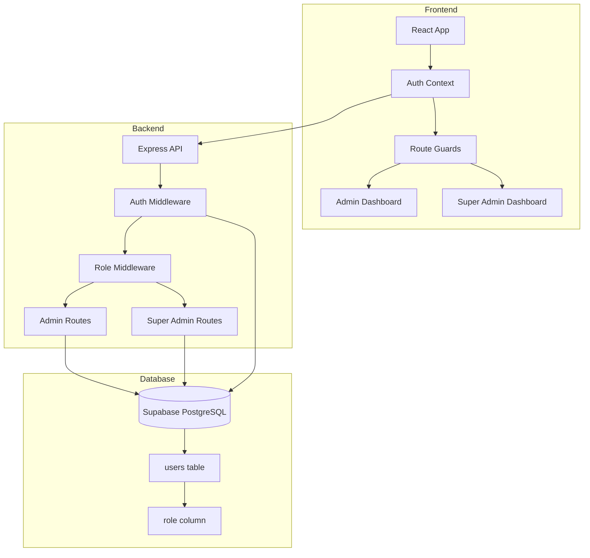
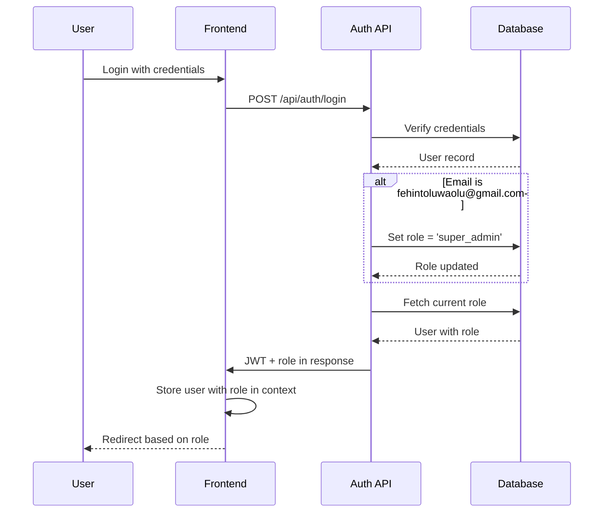
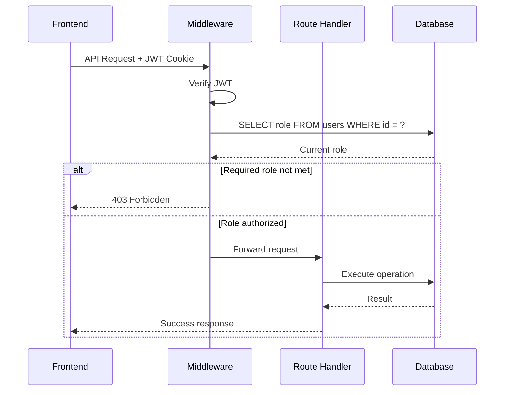

# Design Document: Role-Based Admin System

## Overview

The role-based admin system introduces a three-tier permission model (user, admin, super_admin) to the Flippe prediction platform. This design ensures secure, hierarchical access control for platform administration and market management.

### Key Design Goals

1. **Security First**: Prevent privilege escalation through multi-layer validation
2. **Hierarchical Permissions**: Clear separation between user, admin, and super_admin capabilities
3. **Permanent Super Admin**: Guarantee platform owner always has full access
4. **Real-time Role Enforcement**: Role changes take effect immediately without requiring re-login
5. **Minimal Frontend Trust**: All authorization decisions made on backend

### Design Principles

- **Defense in Depth**: Role checks on both frontend (UX) and backend (security)
- **Fail Secure**: Default to denying access when role is unclear
- **Audit Trail**: Log all role modification attempts
- **Stateless Validation**: Fetch role from database on each request, not from cached tokens

## Architecture

### System Components



### Authentication Flow



### Authorization Flow



## Components and Interfaces

### Database Layer

#### Schema Changes

**users table modification:**
```sql
ALTER TABLE users ADD COLUMN role VARCHAR(20) NOT NULL DEFAULT 'user' 
  CHECK (role IN ('user', 'admin', 'super_admin'));

CREATE INDEX idx_users_role ON users(role);
```

**Migration strategy:**
- Add column with default value 'user' (safe for existing records)
- Create index for efficient role-based queries
- Set fehintoluwaolu@gmail.com to 'super_admin' in migration

### Backend Layer

#### Middleware Components

**1. Authentication Middleware (`requireAuth`)**
- Validates JWT token from cookie
- Extracts userId from token
- Attaches userId to request object
- Returns 401 if token invalid/missing

**2. Role Middleware (`requireRole`)**
- Fetches current role from database (not from token)
- Compares against required role(s)
- Returns 403 if role insufficient
- Logs authorization attempts

**3. Super Admin Protection Middleware (`protectPrimarySuperAdmin`)**
- Prevents modification of fehintoluwaolu@gmail.com role
- Returns 403 with specific error message
- Applied to role modification endpoints

#### API Endpoints

**Admin Management Endpoints:**

```typescript
// Super admin only - Add admin
POST /api/admin/add-admin
Body: { email: string }
Response: { success: boolean, user: { id, email, username, role } }
Errors: 400 (user not found), 403 (not super_admin), 409 (already admin)

// Super admin only - Remove admin
POST /api/admin/remove-admin
Body: { userId: string }
Response: { success: boolean, user: { id, email, username, role } }
Errors: 403 (not super_admin, or target is primary super admin), 404 (user not found)

// Super admin only - List admins
GET /api/admin/list-admins
Response: { admins: Array<{ id, email, username, role, isPrimary }> }
Errors: 403 (not super_admin)

// Super admin only - Platform analytics
GET /api/admin/analytics
Response: { 
  totalUsers: number,
  totalForecasts: number,
  totalVolume: number,
  activeMarkets: number,
  resolvedMarkets: number,
  pendingMarkets: number
}
Errors: 403 (not super_admin)

// Admin or super_admin - Create market
POST /api/markets/create
Body: { question, description, currency, minPosition, maxPosition, closesAt }
Response: { market: MarketObject }
Errors: 403 (not admin/super_admin)

// Admin or super_admin - Edit market
PUT /api/markets/:marketId
Body: { question?, description?, closesAt? }
Response: { market: MarketObject }
Errors: 403 (not admin/super_admin), 404 (market not found)

// Admin or super_admin - Resolve market
POST /api/markets/:marketId/resolve
Body: { winningSide: 'YES' | 'NO' }
Response: { market: MarketObject }
Errors: 403 (not admin/super_admin), 404 (market not found), 400 (already resolved)

// Admin or super_admin - Close market
POST /api/markets/:marketId/close
Response: { market: MarketObject }
Errors: 403 (not admin/super_admin), 404 (market not found)
```

**Authentication Endpoint Modifications:**

```typescript
// Modified login endpoint
POST /api/auth/login
Body: { email: string, password: string }
Response: { 
  user: { id, username, email, role },
  message: string 
}
// Special handling: If email === 'fehintoluwaolu@gmail.com', ensure role = 'super_admin'

// Modified signup endpoint
POST /api/auth/signup
Body: { username: string, email: string, password: string }
Response: { 
  user: { id, username, email, role },
  message: string 
}
// Special handling: If email === 'fehintoluwaolu@gmail.com', set role = 'super_admin'

// Modified me endpoint
GET /api/auth/me
Response: { user: { id, username, email, role } }
// Always fetch fresh role from database
```

### Frontend Layer

#### Type Definitions

```typescript
// Updated AuthUser type
type AuthUser = {
  id: string;
  email: string;
  username: string;
  name: string;
  balance: number;
  role: 'user' | 'admin' | 'super_admin';
};

// Role check utilities
type UserRole = 'user' | 'admin' | 'super_admin';

const hasRole = (user: AuthUser | null, role: UserRole): boolean => {
  if (!user) return false;
  const roleHierarchy = { user: 0, admin: 1, super_admin: 2 };
  return roleHierarchy[user.role] >= roleHierarchy[role];
};

const isSuperAdmin = (user: AuthUser | null): boolean => {
  return user?.role === 'super_admin';
};

const isAdmin = (user: AuthUser | null): boolean => {
  return user?.role === 'admin' || user?.role === 'super_admin';
};
```

#### Route Guards

**ProtectedRoute Component:**
```typescript
interface ProtectedRouteProps {
  children: React.ReactNode;
  requiredRole?: 'user' | 'admin' | 'super_admin';
  redirectTo?: string;
}

// Redirects to login if not authenticated
// Redirects to home if role insufficient
// Renders children if authorized
```

#### Page Components

**1. Admin Dashboard (`/admin`)**
- Accessible by: admin, super_admin
- Features:
  - Market creation form
  - Active markets list with edit/close/resolve actions
  - Market statistics

**2. Super Admin Dashboard (`/super-admin`)**
- Accessible by: super_admin only
- Features:
  - Platform analytics cards (users, forecasts, volume, markets)
  - Admin management section:
    - Add admin by email form
    - List of current admins with remove buttons
    - Primary super admin indicator (cannot be removed)
  - Platform activity feed

**3. Navigation Updates**
- Show "Admin" link if user is admin or super_admin
- Show "Super Admin" link if user is super_admin
- Hide admin links for regular users

## Data Models

### User Model (Updated)

```typescript
interface User {
  id: string;                    // UUID
  username: string;              // 3-50 chars, unique
  email: string;                 // Valid email, unique
  password_hash: string;         // Bcrypt hash
  role: 'user' | 'admin' | 'super_admin';  // NEW FIELD
  profile_picture_url?: string;
  instagram_handle?: string;
  twitter_handle?: string;
  created_at: Date;
  updated_at: Date;
}
```

### Database Constraints

```sql
-- Role must be one of three values
CHECK (role IN ('user', 'admin', 'super_admin'))

-- Default role for new users
DEFAULT 'user'

-- Index for role-based queries
CREATE INDEX idx_users_role ON users(role);

-- Prevent direct role modification (enforced by RLS policies)
-- Only super_admin can modify roles through specific endpoints
```

### Role Hierarchy

```
super_admin (level 2)
    ├── All admin permissions
    ├── Manage admins (add/remove)
    ├── View platform analytics
    └── Cannot be removed (for primary super admin)

admin (level 1)
    ├── Create markets
    ├── Edit markets
    ├── Resolve markets
    ├── Close markets
    └── Cannot manage other admins

user (level 0)
    ├── View markets
    ├── Create positions
    ├── Manage own wallet
    └── View own profile
```


## Correctness Properties

*A property is a characteristic or behavior that should hold true across all valid executions of a system—essentially, a formal statement about what the system should do. Properties serve as the bridge between human-readable specifications and machine-verifiable correctness guarantees.*

### Property Reflection

After analyzing all acceptance criteria, I identified the following redundancies:
- Properties 7.1-7.7 (analytics fields) can be combined into one property about analytics response structure
- Properties 8.3-8.4 (admin list fields) can be combined into one property about admin list response structure
- Properties 5.1-5.4 (admin market operations) can be combined into one property about admin authorization
- Property 2.4 is redundant with 2.3 (both test primary super admin role assignment)
- Property 4.3 is redundant with 2.5 (both test primary super admin protection)
- Properties 6.3 and 6.5 are redundant with 6.1, 6.2, and 6.4

### Property 1: Role Enum Validation

*For any* user creation or update operation, the system should only accept role values from the set {'user', 'admin', 'super_admin'} and reject any other role value.

**Validates: Requirements 1.1**

### Property 2: Default Role Assignment

*For any* new user signup (excluding fehintoluwaolu@gmail.com), the system should assign the role "user" by default.

**Validates: Requirements 1.2**

### Property 3: Self-Role Modification Prevention

*For any* authenticated user regardless of their role, attempts to modify their own role should be rejected with a 403 Forbidden response.

**Validates: Requirements 1.4, 11.2**

### Property 4: Primary Super Admin Auto-Provisioning

*When* the user with email "fehintoluwaolu@gmail.com" signs in, the system should ensure their role is set to "super_admin".

**Validates: Requirements 2.3, 2.4**

### Property 5: Primary Super Admin Protection

*When* any user attempts to remove or modify the super_admin role from "fehintoluwaolu@gmail.com", the system should reject the request with a 403 Forbidden response.

**Validates: Requirements 2.5, 4.3**

### Property 6: Add Admin Email Validation

*For any* email submitted to the add-admin endpoint, the system should verify the email exists in the users table before proceeding, and return an error if it does not exist.

**Validates: Requirements 3.2, 3.4**

### Property 7: Add Admin Role Update

*For any* existing user added as admin by a super admin, the system should update their role to "admin".

**Validates: Requirements 3.3**

### Property 8: Remove Admin Role Downgrade

*For any* user with role "admin" when a super admin removes their admin access, the system should change their role from "admin" to "user".

**Validates: Requirements 4.2**

### Property 9: Immediate Role Effect

*For any* user whose role is changed, the system should apply the new role on their next authenticated request, immediately affecting their access to protected routes.

**Validates: Requirements 4.4, 12.3**

### Property 10: Admin Market Management Authorization

*For any* user with role "admin" or "super_admin", the system should allow them to create, edit, resolve, and close markets.

**Validates: Requirements 5.1, 5.2, 5.3, 5.4**

### Property 11: User Market Management Denial

*For any* user with role "user", the system should deny access to all market management functions (create, edit, resolve, close) with a 403 Forbidden response.

**Validates: Requirements 5.5**

### Property 12: Admin Cannot Manage Admins

*For any* user with role "admin", the system should deny access to add or remove admin privileges with a 403 Forbidden response.

**Validates: Requirements 6.1, 6.2**

### Property 13: Admin Cannot Access Super Admin Routes

*For any* user with role "admin", the system should deny access to super admin API endpoints with a 403 Forbidden response.

**Validates: Requirements 6.4**

### Property 14: Analytics Response Completeness

*For any* super admin requesting platform analytics, the system should return a response containing all required fields: totalUsers, totalForecasts, totalVolume, activeMarkets, resolvedMarkets, pendingMarkets, and activityFeed.

**Validates: Requirements 7.1, 7.2, 7.3, 7.4, 7.5, 7.6, 7.7**

### Property 15: Admin List Completeness

*For any* super admin requesting the admin list, the system should return all users with role "admin" or "super_admin".

**Validates: Requirements 8.1**

### Property 16: Admin List Response Structure

*For any* admin in the admin list response, the system should include their email and username fields.

**Validates: Requirements 8.3, 8.4**

### Property 17: Admin List Access Restriction

*For any* user with role "admin" or "user", the system should deny access to the admin list endpoint with a 403 Forbidden response.

**Validates: Requirements 8.5**

### Property 18: Frontend User Route Blocking

*For any* user with role "user" attempting to access an admin route on the frontend, the system should redirect them to the home page.

**Validates: Requirements 9.1**

### Property 19: Frontend Admin Route Blocking

*For any* user with role "admin" attempting to access a super admin route on the frontend, the system should redirect them to the home page.

**Validates: Requirements 9.2**

### Property 20: Frontend Admin Route Access

*For any* user with role "admin" or "super_admin" accessing an admin route on the frontend, the system should render the requested page.

**Validates: Requirements 9.3**

### Property 21: Frontend Super Admin Route Access

*For any* user with role "super_admin" accessing a super admin route on the frontend, the system should render the requested page.

**Validates: Requirements 9.4**

### Property 22: Frontend Unauthenticated Redirect

*For any* unauthenticated user attempting to access an admin or super admin route on the frontend, the system should redirect them to the login page.

**Validates: Requirements 9.5**

### Property 23: Backend User Authorization

*For any* user with role "user" calling an admin API endpoint, the system should return HTTP 403 Forbidden.

**Validates: Requirements 10.1**

### Property 24: Backend Admin Authorization

*For any* user with role "admin" calling a super admin API endpoint, the system should return HTTP 403 Forbidden.

**Validates: Requirements 10.2**

### Property 25: Backend Unauthenticated Authorization

*For any* unauthenticated request to an admin or super admin API endpoint, the system should return HTTP 401 Unauthorized.

**Validates: Requirements 10.3**

## Error Handling

### Error Response Format

All API errors follow a consistent format:

```typescript
{
  error: {
    code: string;           // Machine-readable error code
    message: string;        // Human-readable error message
    timestamp: string;      // ISO 8601 timestamp
  }
}
```

### Error Codes

**Authentication Errors:**
- `UNAUTHORIZED` (401): Missing or invalid authentication token
- `INVALID_TOKEN` (401): JWT token expired or malformed
- `INVALID_CREDENTIALS` (401): Wrong email/password combination

**Authorization Errors:**
- `FORBIDDEN` (403): User lacks required role for operation
- `FORBIDDEN_PRIMARY_SUPER_ADMIN` (403): Attempt to modify primary super admin
- `FORBIDDEN_SELF_ROLE_MODIFICATION` (403): Attempt to modify own role

**Validation Errors:**
- `VALIDATION_ERROR` (400): Invalid input data
- `USER_NOT_FOUND` (404): Email not found in users table
- `MARKET_NOT_FOUND` (404): Market ID not found
- `ALREADY_ADMIN` (409): User already has admin role
- `ALREADY_RESOLVED` (400): Market already resolved

### Error Handling Strategy

**Frontend:**
1. Display user-friendly error messages
2. Redirect to appropriate page based on error code
3. Clear auth state on 401 errors
4. Show toast notifications for operation failures

**Backend:**
1. Log all authorization failures with user ID and attempted action
2. Return specific error codes for different failure modes
3. Never expose internal implementation details in error messages
4. Rate limit failed authorization attempts

### Security Considerations

**Privilege Escalation Prevention:**
- All role checks performed on backend (never trust frontend)
- Role fetched fresh from database on each request
- Primary super admin email hardcoded in backend
- Role modification endpoints protected by multiple middleware layers

**Audit Trail:**
- Log all role modification attempts (success and failure)
- Log all admin action attempts by non-admins
- Include timestamp, user ID, attempted action, and result

**Session Security:**
- JWT tokens do not contain role (prevents token manipulation)
- Tokens expire after 24 hours
- HttpOnly cookies prevent XSS attacks
- Secure flag enabled in production

## Testing Strategy

### Dual Testing Approach

This feature requires both unit tests and property-based tests for comprehensive coverage:

**Unit Tests** focus on:
- Specific examples (e.g., primary super admin email handling)
- Edge cases (e.g., empty email, malformed requests)
- Error conditions (e.g., 401, 403 responses)
- Integration points (e.g., database constraints, middleware chains)

**Property-Based Tests** focus on:
- Universal properties across all inputs (e.g., role validation for any user)
- Authorization rules for all role combinations
- Comprehensive input coverage through randomization

### Property-Based Testing Configuration

**Framework:** fast-check (for TypeScript/JavaScript)

**Configuration:**
- Minimum 100 iterations per property test
- Each test tagged with reference to design property
- Tag format: `Feature: role-based-admin-system, Property {number}: {property_text}`

**Example Property Test Structure:**

```typescript
import fc from 'fast-check';

// Feature: role-based-admin-system, Property 1: Role Enum Validation
test('should only accept valid role values', async () => {
  await fc.assert(
    fc.asyncProperty(
      fc.string(), // Generate random role values
      async (role) => {
        const validRoles = ['user', 'admin', 'super_admin'];
        if (validRoles.includes(role)) {
          // Should succeed
          // Test implementation
        } else {
          // Should fail with validation error
          // Test implementation
        }
      }
    ),
    { numRuns: 100 }
  );
});
```

### Test Coverage Requirements

**Backend:**
- Middleware: 100% coverage (critical security component)
- Admin routes: 100% coverage
- Auth modifications: 100% coverage
- Role validation: 100% coverage

**Frontend:**
- Route guards: 100% coverage
- Role utility functions: 100% coverage
- Admin components: 80% coverage (UI rendering less critical)

### Integration Testing

**Test Scenarios:**
1. Complete admin lifecycle: signup → promote to admin → perform admin action → demote to user
2. Primary super admin: signup with special email → verify auto-promotion → verify protection
3. Role change immediate effect: change role → make API call → verify new permissions
4. Multi-user scenarios: admin and user simultaneously accessing different endpoints
5. Security: attempt privilege escalation via token manipulation, direct API calls, etc.

### Manual Testing Checklist

- [ ] Primary super admin can access all features
- [ ] Admin can manage markets but not other admins
- [ ] Regular user cannot access admin features
- [ ] Role changes take effect immediately
- [ ] Frontend route guards work correctly
- [ ] Backend authorization returns correct status codes
- [ ] Error messages are user-friendly
- [ ] Audit logs capture role modifications

